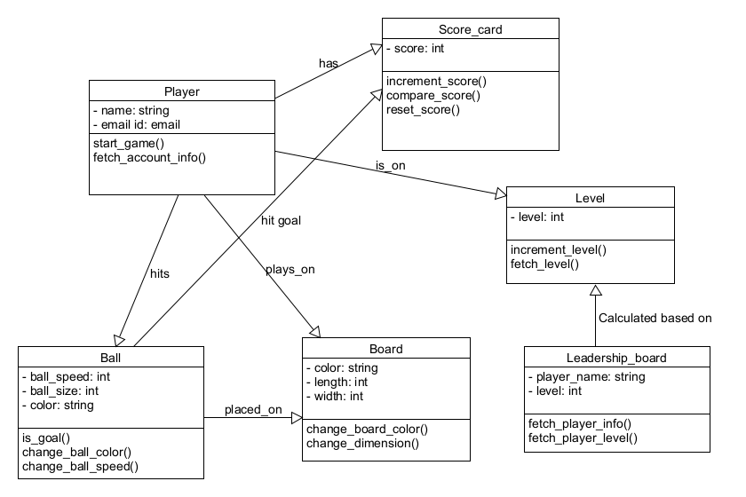

# About the game

The game can be played in single or a player mode.
A player firstly needs to have an account to play the game.
You can create an account in case of not having an account.

# Rules for playing Game

Game will be started by player 1. Player 2 can be another player or a bot. A goal is considered when the ball hits the wall of the opposite player. The player who first scores 10 goals is considered as the winner of the game.

