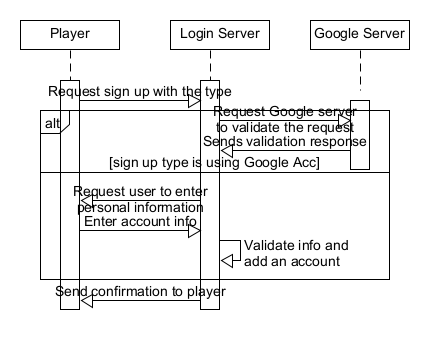

# Sign up

## Feature

Sign UP

## Acceptance Criteria

Player successfully got registered

### Scenario: Sign up using google

  Given - Player has a google account

  When - Player sign in using google account

  Then - Player should get registered in the database

### Scenario: Sign up using general information

  Given - NA

  When - Player enters personal information with a password

  Then - Player should get registered in the database

